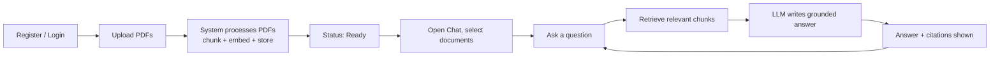
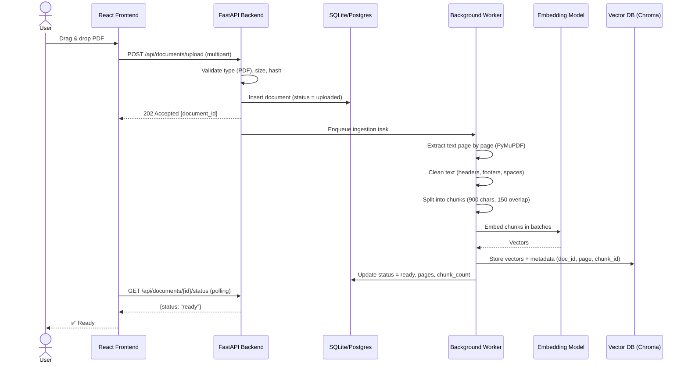
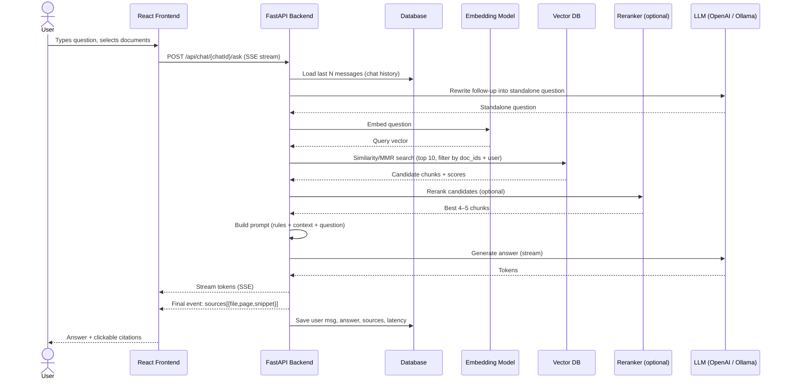
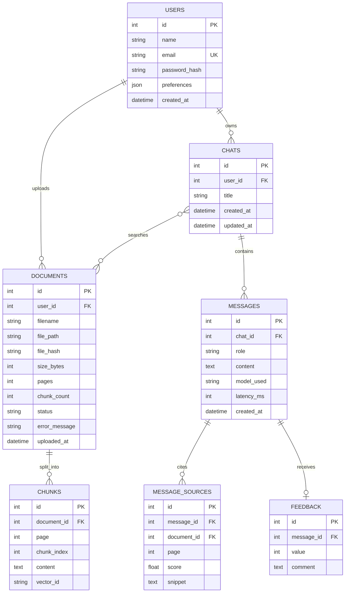

# P_102 — Academic Question Answering System Using RAG
### A Web Application for Asking Questions over Your Study PDFs

| Field | Detail |
|---|---|
| **Project ID** | P_102 |
| **Project Type** | LLM |
| **Domain** | Education / Cross-Industry AI Tooling |
| **Synopsis** | Answers academic questions via retrieval over study PDFs |
| **Prerequisites** | Laptop 8 GB; LangChain, Vector DB, OpenAI / LLaMA |

---

## Table of Contents
1. [Project Overview](#1-project-overview)
2. [Website: What the User Sees & Does](#2-website-what-the-user-sees--does)
3. [End-to-End Workflow (Step by Step)](#3-end-to-end-workflow-step-by-step)
4. [System Architecture](#4-system-architecture)
5. [Tech Stack](#5-tech-stack)
6. [Complete Folder Structure](#6-complete-folder-structure)
7. [Backend Working (API + Modules)](#7-backend-working-api--modules)
8. [RAG Pipeline in Detail](#8-rag-pipeline-in-detail)
9. [Database Design](#9-database-design)
10. [Frontend Working](#10-frontend-working)
11. [Authentication & Security](#11-authentication--security)
12. [Error Handling & Edge Cases](#12-error-handling--edge-cases)
13. [Configuration & Setup](#13-configuration--setup)
14. [Deployment](#14-deployment)
15. [Testing & Evaluation](#15-testing--evaluation)
16. [Development Roadmap](#16-development-roadmap)
17. [Risks & Mitigations](#17-risks--mitigations)
18. [Future Enhancements](#18-future-enhancements)
19. [Submission Checklist](#19-submission-checklist)

---

## 1. Project Overview

**StudyMate RAG** is a website where a student uploads study material (textbooks, lecture notes, research papers as PDFs) and then chats with it. Every answer is **grounded in the uploaded documents** and shows **which file and page** it came from.

**Why RAG (Retrieval-Augmented Generation)?**
A plain LLM doesn't know your syllabus and can hallucinate. RAG first *retrieves* the relevant passages from your PDFs, then asks the LLM to answer *only from those passages*.

### Goals
- Upload and manage multiple PDFs from a browser.
- Ask questions in natural language and get answers with citations.
- Say "not found in the documents" instead of guessing.
- Keep chat history per user and per subject.
- Run on an 8 GB laptop.

### Non-Goals (v1)
- Fine-tuning models, mobile apps, large-scale multi-tenant cloud hosting.

### Target Users
Students, teachers preparing material, researchers going through papers.

---

## 2. Website: What the User Sees & Does

### 2.1 Site Map

```
StudyMate RAG
├── /login                → Login page
├── /register             → Sign-up page
├── /dashboard            → Overview: subjects, recent chats, storage used
├── /library              → Upload & manage PDFs (Document Library)
├── /chat                 → New chat (choose which documents to search)
├── /chat/:chatId         → Existing conversation
├── /history              → All past chats, search & delete
└── /settings             → Model, top-k, theme, profile, API key
```

### 2.2 Page-by-Page Description

#### Login / Register
- Email + password form, validation messages, "Remember me".
- On success → JWT stored → redirected to Dashboard.

#### Dashboard
```
┌───────────────────────────────────────────────────────────────┐
│  StudyMate RAG          [Library] [Chat] [History]   👤 Amit ▼│
├───────────────────────────────────────────────────────────────┤
│  Welcome back, Amit!                                          │
│  ┌──────────┐ ┌──────────┐ ┌──────────┐                       │
│  │ 12 PDFs  │ │ 48 Chats │ │ 230 MB   │   [ + Upload PDF ]    │
│  └──────────┘ └──────────┘ └──────────┘   [ + New Chat  ]     │
│                                                               │
│  Recent conversations                                         │
│   • What is backpropagation?            (ML_Notes.pdf) 2h ago │
│   • Explain ACID properties             (DBMS.pdf)     1d ago │
└───────────────────────────────────────────────────────────────┘
```

#### Document Library (upload page)
```
┌───────────────────────────────────────────────────────────────┐
│  ┌─────────────────────────────────────────────────────────┐  │
│  │      ⬆  Drag & drop PDFs here, or click to browse        │  │
│  └─────────────────────────────────────────────────────────┘  │
│                                                               │
│  File                 Pages  Chunks  Status         Actions   │
│  ML_Notes.pdf          120    310    ✅ Ready       🗑         │
│  DBMS_Unit3.pdf         45    102    ⏳ Processing 62%         │
│  OS_Scanned.pdf          –      –    ❌ Failed (no text)  ↻   │
└───────────────────────────────────────────────────────────────┘
```
- Upload progress bar, then a **processing status** that updates live (polling or WebSocket).
- Status states: `Uploaded → Processing → Ready / Failed`.
- Delete removes the file, its chunks, and vectors.

#### Chat Page (main feature)
```
┌──────────────┬────────────────────────────────────────────────┐
│ Search in:   │  You: What is normalization in DBMS?           │
│ ☑ ML_Notes   │                                                │
│ ☑ DBMS_Unit3 │  🤖 Normalization is the process of organizing │
│ ☐ OS_Notes   │  tables to reduce redundancy and improve       │
│              │  integrity. It is done through normal forms    │
│ [New Chat]   │  (1NF, 2NF, 3NF, BCNF).  [1] [2]               │
│              │                                                │
│ Chat list:   │  ▸ Sources                                     │
│  • ACID      │   [1] DBMS_Unit3.pdf — p.14  "Normalization…"  │
│  • SQL joins │   [2] DBMS_Unit3.pdf — p.15  "1NF requires…"   │
│              │                                                │
│              │  👍 👎  📋 Copy  🔄 Regenerate                  │
│              ├────────────────────────────────────────────────┤
│              │  [ Type your question…                  ] [➤]  │
└──────────────┴────────────────────────────────────────────────┘
```
Key behaviours:
- **Streaming answer** (tokens appear as they're generated).
- **Clickable citations** `[1] [2]` open a side panel showing the exact source snippet (and optionally the PDF page).
- **Document filter**: user picks which PDFs to search.
- **Follow-up questions** work (the system rewrites them into standalone questions using chat history).
- **Feedback** 👍/👎 saved for evaluation.
- If nothing relevant is found: *"I couldn't find this in the provided documents."*

#### History
List of past chats with search, rename, delete, export as PDF/Markdown.

#### Settings
LLM provider (OpenAI / Ollama), model name, temperature, top-k, chunk display, dark/light theme, delete account/data.

---

## 3. End-to-End Workflow (Step by Step)

### 3.1 Big Picture — User Journey



### 3.2 Workflow A — Document Upload & Ingestion



**Steps in words**
1. User uploads a PDF in the browser.
2. Backend validates it (is PDF, ≤ 50 MB, not a duplicate via SHA-256 hash).
3. File saved to `data/raw_pdfs/{user_id}/`, a DB row created with status `uploaded`.
4. A background task starts (status `processing`).
5. Text extracted page by page; each page keeps its page number.
6. Text cleaned (headers/footers, page numbers, broken hyphenation).
7. Text split into overlapping chunks, each tagged with `{document_id, filename, page}`.
8. Chunks embedded into vectors and saved in the vector DB.
9. Status becomes `ready`; the UI updates.
10. If no text is found (scanned PDF) → OCR fallback, or status `failed` with a helpful message.

### 3.3 Workflow B — Asking a Question (Query Time)



**Steps in words**
1. User types a question; frontend sends it with selected document IDs.
2. Backend loads recent chat history.
3. If it's a follow-up ("what about its types?"), the LLM rewrites it into a standalone question ("What are the types of normalization?").
4. The question is converted to a vector.
5. Vector DB returns the most similar chunks — **only from this user's selected documents**.
6. (Optional) Reranker re-scores them for better precision.
7. A prompt is built: *rules + retrieved context + question*.
8. LLM generates the answer, streamed to the browser.
9. Sources (file, page, snippet) are sent along and shown as citations.
10. Everything is saved in the DB so the chat can be reopened later.
11. If retrieval scores are below a threshold → return the "not found" message instead of calling the LLM.

### 3.4 Workflow C — Delete a Document
`DELETE /api/documents/{id}` → delete vectors where `doc_id = id` → delete file from disk → delete DB rows (chunks metadata). Existing chat messages keep their text but citations show "source removed".

### 3.5 Workflow D — Feedback Loop
User clicks 👍/👎 → `POST /api/messages/{id}/feedback` → stored → used later to find weak questions and tune chunking / top-k.

---

## 4. System Architecture

```
┌──────────────────────────── CLIENT (Browser) ─────────────────────────────┐
│  React + Vite + Tailwind                                                  │
│  Pages: Login · Dashboard · Library · Chat · History · Settings           │
└───────────────┬───────────────────────────────────────────────────────────┘
                │ HTTPS  (REST + Server-Sent Events for streaming)
┌───────────────▼────────────────────── BACKEND (FastAPI) ──────────────────┐
│  Routers:  /auth  /documents  /chat  /history  /settings                  │
│  ┌────────────┐  ┌────────────────┐  ┌───────────────────────────────┐    │
│  │ Auth (JWT) │  │ Ingestion Svc  │  │ RAG Service                   │    │
│  └────────────┘  │ load→clean→    │  │ rewrite→embed→retrieve→       │    │
│                  │ chunk→embed    │  │ rerank→prompt→LLM→cite        │    │
│                  └───────┬────────┘  └───────┬───────────────────────┘    │
│           Background tasks (FastAPI BackgroundTasks / Celery+Redis)       │
└───────┬───────────────────┬───────────────────┬───────────────────┬───────┘
        │                   │                   │                   │
   ┌────▼─────┐      ┌──────▼──────┐     ┌──────▼──────┐     ┌──────▼──────┐
   │ SQLite / │      │ File Store  │     │ Vector DB   │     │ LLM         │
   │ Postgres │      │ data/raw_   │     │ ChromaDB    │     │ OpenAI API  │
   │ users,   │      │ pdfs/       │     │ (persistent)│     │ or Ollama   │
   │ chats…   │      └─────────────┘     └─────────────┘     └─────────────┘
   └──────────┘
```

**Design principle:** frontend is only UI; all intelligence (RAG) lives in the backend so API keys stay secret and models can be swapped without touching the UI.

---

## 5. Tech Stack

| Layer | Primary Choice | Alternatives |
|---|---|---|
| Frontend | React + Vite + Tailwind CSS | Next.js, plain HTML/JS, Streamlit (quick demo) |
| State / API calls | React Query + Axios | Redux, fetch |
| Backend | FastAPI (Python 3.10+) | Flask, Django REST |
| Orchestration | LangChain | LlamaIndex |
| PDF parsing | PyMuPDF (`fitz`) | `pypdf`, `pdfplumber`, `unstructured` |
| OCR (fallback) | `ocrmypdf` / `pytesseract` | — |
| Chunking | `RecursiveCharacterTextSplitter` | Semantic chunking |
| Embeddings | `all-MiniLM-L6-v2` (local, light) | OpenAI `text-embedding-3-small`, `bge-small-en` |
| Vector DB | ChromaDB | FAISS, Qdrant, Pinecone |
| LLM | OpenAI `gpt-4o-mini` | LLaMA 3.2 3B / Llama 3.1 8B (Q4) via Ollama |
| Reranker | `cross-encoder/ms-marco-MiniLM-L-6-v2` | Cohere Rerank |
| Relational DB | SQLite (dev) → PostgreSQL (prod) | MySQL |
| ORM | SQLAlchemy + Alembic | SQLModel |
| Auth | JWT (`python-jose`) + `passlib[bcrypt]` | OAuth (Google login) |
| Background jobs | FastAPI `BackgroundTasks` | Celery + Redis |
| Streaming | Server-Sent Events (SSE) | WebSocket |
| Evaluation | RAGAS | Manual test set |
| Testing | `pytest`, `httpx`, Vitest | — |
| Containers | Docker + docker-compose | — |

> **8 GB laptop tip:** MiniLM embeddings + OpenAI API for the LLM is the smoothest. For fully offline, use Ollama with `llama3.2:3b` and close other heavy apps.

---

## 6. Complete Folder Structure

```
studymate-rag/
├── README.md
├── docker-compose.yml
├── .env.example                      # API keys, DB URL, JWT secret
├── .gitignore
│
├── backend/
│   ├── requirements.txt
│   ├── Dockerfile
│   ├── alembic/                      # DB migrations
│   ├── app/
│   │   ├── main.py                   # FastAPI app, CORS, router registration
│   │   ├── core/
│   │   │   ├── config.py             # settings loaded from .env / YAML
│   │   │   ├── security.py           # password hashing, JWT create/verify
│   │   │   └── logger.py
│   │   ├── api/
│   │   │   ├── deps.py               # get_db, get_current_user
│   │   │   └── routes/
│   │   │       ├── auth.py           # register, login, me
│   │   │       ├── documents.py      # upload, list, status, delete
│   │   │       ├── chat.py           # create chat, ask (SSE), list messages
│   │   │       ├── history.py        # list/rename/delete/export chats
│   │   │       ├── feedback.py       # thumbs up/down
│   │   │       └── settings.py       # user preferences
│   │   ├── models/                   # SQLAlchemy tables
│   │   │   ├── user.py
│   │   │   ├── document.py
│   │   │   ├── chat.py
│   │   │   └── message.py
│   │   ├── schemas/                  # Pydantic request/response models
│   │   │   ├── auth.py
│   │   │   ├── document.py
│   │   │   └── chat.py
│   │   ├── db/
│   │   │   ├── session.py
│   │   │   └── base.py
│   │   ├── services/
│   │   │   ├── ingestion/
│   │   │   │   ├── loader.py         # PDF → pages + metadata
│   │   │   │   ├── ocr.py            # scanned-PDF fallback
│   │   │   │   ├── cleaner.py        # headers/footers/whitespace
│   │   │   │   ├── chunker.py        # overlapping chunks
│   │   │   │   └── pipeline.py       # orchestrates the whole ingestion
│   │   │   ├── embeddings.py         # embedding model wrapper
│   │   │   ├── vectorstore.py        # add / search / delete by doc_id
│   │   │   ├── retrieval/
│   │   │   │   ├── retriever.py      # top-k / MMR, user+doc filters
│   │   │   │   └── reranker.py
│   │   │   ├── generation/
│   │   │   │   ├── prompts.py        # system, QA, rewrite prompts
│   │   │   │   ├── llm.py            # OpenAI / Ollama factory
│   │   │   │   └── rag_chain.py      # rewrite→retrieve→prompt→stream
│   │   │   └── evaluation.py
│   │   └── utils/
│   │       ├── file_utils.py         # hashing, safe filenames
│   │       └── helpers.py
│   ├── scripts/
│   │   ├── ingest_folder.py          # CLI bulk ingest
│   │   └── ask.py                    # CLI question
│   ├── evaluation/
│   │   ├── dataset.json              # question / ground-truth pairs
│   │   └── run_ragas.py
│   └── tests/
│       ├── test_auth.py
│       ├── test_upload.py
│       ├── test_chunker.py
│       ├── test_retriever.py
│       └── test_rag_chain.py
│
├── frontend/
│   ├── package.json
│   ├── vite.config.js
│   ├── tailwind.config.js
│   ├── index.html
│   └── src/
│       ├── main.jsx
│       ├── App.jsx                   # routes
│       ├── api/
│       │   ├── client.js             # axios instance + JWT interceptor
│       │   ├── auth.js
│       │   ├── documents.js
│       │   └── chat.js               # includes SSE stream helper
│       ├── context/
│       │   └── AuthContext.jsx
│       ├── hooks/
│       │   ├── useDocuments.js       # list + status polling
│       │   └── useChatStream.js      # handles streaming tokens
│       ├── pages/
│       │   ├── Login.jsx
│       │   ├── Register.jsx
│       │   ├── Dashboard.jsx
│       │   ├── Library.jsx
│       │   ├── Chat.jsx
│       │   ├── History.jsx
│       │   └── Settings.jsx
│       ├── components/
│       │   ├── Navbar.jsx
│       │   ├── Sidebar.jsx
│       │   ├── UploadDropzone.jsx
│       │   ├── DocumentTable.jsx
│       │   ├── DocumentSelector.jsx   # checkboxes for search scope
│       │   ├── ChatWindow.jsx
│       │   ├── MessageBubble.jsx
│       │   ├── CitationChip.jsx
│       │   ├── SourcePanel.jsx        # shows snippet / PDF page
│       │   ├── FeedbackButtons.jsx
│       │   └── ProtectedRoute.jsx
│       └── styles/
│           └── index.css
│
├── data/                              # git-ignored, created at runtime
│   ├── raw_pdfs/{user_id}/            # uploaded files
│   ├── vector_store/                  # Chroma persistence
│   └── app.db                         # SQLite (dev)
│
└── docs/
    ├── architecture.png
    ├── er_diagram.png
    ├── api_reference.md
    ├── report.md
    └── demo_screenshots/
```

---

## 7. Backend Working (API + Modules)

### 7.1 REST API Reference

| Method | Endpoint | Purpose | Auth |
|---|---|---|---|
| POST | `/api/auth/register` | Create account | No |
| POST | `/api/auth/login` | Get JWT token | No |
| GET | `/api/auth/me` | Current user profile | Yes |
| POST | `/api/documents/upload` | Upload a PDF (multipart) | Yes |
| GET | `/api/documents` | List user's documents | Yes |
| GET | `/api/documents/{id}/status` | Processing status/progress | Yes |
| GET | `/api/documents/{id}/file` | Download / view original PDF | Yes |
| DELETE | `/api/documents/{id}` | Delete PDF + vectors | Yes |
| POST | `/api/chats` | Create new chat `{title, document_ids}` | Yes |
| GET | `/api/chats` | List chats (history) | Yes |
| GET | `/api/chats/{id}` | Get chat with all messages | Yes |
| POST | `/api/chats/{id}/ask` | Ask question → **SSE stream** | Yes |
| PATCH | `/api/chats/{id}` | Rename chat / change documents | Yes |
| DELETE | `/api/chats/{id}` | Delete chat | Yes |
| GET | `/api/chats/{id}/export?format=md\|pdf` | Export conversation | Yes |
| POST | `/api/messages/{id}/feedback` | 👍 / 👎 `{value, comment}` | Yes |
| GET/PUT | `/api/settings` | Read / update preferences | Yes |
| GET | `/api/health` | Health check | No |

### 7.2 Example Requests / Responses

**Upload**
```http
POST /api/documents/upload
Authorization: Bearer <JWT>
Content-Type: multipart/form-data

file=@DBMS_Unit3.pdf
```
```json
{ "document_id": 17, "filename": "DBMS_Unit3.pdf", "status": "uploaded" }
```

**Status**
```json
{ "document_id": 17, "status": "processing", "progress": 62,
  "pages": 45, "chunks": 64 }
```

**Ask (request)**
```json
{
  "question": "What is normalization?",
  "document_ids": [17, 18],
  "top_k": 5
}
```

**Ask (SSE stream events)**
```
event: token
data: {"text": "Normalization is "}

event: token
data: {"text": "the process of organizing tables…"}

event: sources
data: {"sources": [
  {"id": 1, "file": "DBMS_Unit3.pdf", "page": 14, "score": 0.83,
   "snippet": "Normalization is the process of…"},
  {"id": 2, "file": "DBMS_Unit3.pdf", "page": 15, "score": 0.79,
   "snippet": "First normal form requires…"}
]}

event: done
data: {"message_id": 204, "latency_ms": 2140}
```

**Error format (all endpoints)**
```json
{ "error": { "code": "DOCUMENT_NOT_READY", "message": "Document is still processing." } }
```

### 7.3 Module Responsibilities

| Module | What it does |
|---|---|
| `routes/auth.py` | Register (hash password), login (issue JWT), `/me` |
| `routes/documents.py` | Validate & save upload, enqueue ingestion, list/delete |
| `routes/chat.py` | Create chats, run RAG chain, stream tokens, save messages |
| `ingestion/loader.py` | Read PDF page by page → `[{page, text}]` |
| `ingestion/cleaner.py` | Remove repeated headers/footers, page numbers, fix hyphens |
| `ingestion/chunker.py` | Split into ~900-char chunks with 150 overlap, keep metadata |
| `ingestion/pipeline.py` | load → clean → chunk → embed → store → update status |
| `embeddings.py` | Load embedding model once; `embed_documents`, `embed_query` |
| `vectorstore.py` | `add_chunks`, `search(query_vec, filter)`, `delete_by_doc` |
| `retrieval/retriever.py` | Top-k / MMR search with `user_id` + `doc_id` filters + score threshold |
| `retrieval/reranker.py` | Cross-encoder rerank (optional) |
| `generation/prompts.py` | Prompt templates |
| `generation/llm.py` | Returns OpenAI or Ollama chat model based on config |
| `generation/rag_chain.py` | Full query pipeline, yields tokens + sources |

---

## 8. RAG Pipeline in Detail

### 8.1 Ingestion Pipeline

| Stage | Detail | Output |
|---|---|---|
| **Load** | PyMuPDF reads each page | `{page: 14, text: "..."}` |
| **OCR fallback** | If page text < 30 chars → OCR | Text from scanned pages |
| **Clean** | Remove repeated lines across pages, page numbers, join hyphenated words | Cleaner text |
| **Chunk** | 900 chars, 150 overlap, split on paragraph → sentence → word | Chunks |
| **Metadata** | `{user_id, document_id, filename, page, chunk_index}` | Filterable, citable chunks |
| **Embed** | MiniLM → 384-dim vectors, batch size 32 | Vectors |
| **Store** | Chroma collection `studymate_chunks` | Persisted index |

### 8.2 Query Pipeline

| Stage | Detail |
|---|---|
| **1. Rewrite** | Turn follow-ups into standalone questions using the last ~4 messages |
| **2. Embed** | Same embedding model as ingestion (must match!) |
| **3. Retrieve** | Top 10 by cosine similarity, filtered by user + selected docs; MMR for diversity |
| **4. Threshold** | If best score < ~0.30 → skip LLM, return "not found" |
| **5. Rerank** | (Optional) cross-encoder → keep best 4–5 |
| **6. Prompt** | Insert numbered context blocks `[1] (file, p.X): text…` |
| **7. Generate** | LLM at temperature 0.1, streamed |
| **8. Cite** | Map `[n]` markers in the answer back to source metadata |
| **9. Save** | Store question, answer, sources, latency, model used |

### 8.3 Prompt Templates

**Answer prompt**
```text
You are an academic assistant. Answer the student's question using ONLY the
numbered context below. Cite sources inline like [1], [2].
If the context does not contain the answer, reply exactly:
"I couldn't find this in the provided documents."
Be clear, structured, and use simple language. Use bullet points or steps
where helpful.

Context:
[1] (DBMS_Unit3.pdf, p.14): ...
[2] (DBMS_Unit3.pdf, p.15): ...

Question: {question}

Answer:
```

**Follow-up rewrite prompt**
```text
Given the chat history and the latest question, rewrite the latest question
so it is fully standalone. Do not answer it.

History: {history}
Latest question: {question}
Standalone question:
```

### 8.4 Tunable Parameters

| Parameter | Default | Effect |
|---|---|---|
| `chunk_size` | 900 | Bigger = more context, less precise |
| `chunk_overlap` | 150 | Prevents cutting ideas in half |
| `top_k` | 5 | More context vs. more noise |
| `use_mmr` | true | Avoids duplicate chunks |
| `score_threshold` | 0.30 | Controls "not found" behaviour |
| `temperature` | 0.1 | Lower = more factual |
| `history_window` | 4 msgs | Memory for follow-ups |

---

## 9. Database Design

### 9.1 ER Diagram



### 9.2 Stores at a Glance

| Store | Holds |
|---|---|
| **SQL DB** | Users, documents, chats, messages, sources, feedback |
| **Vector DB (Chroma)** | Embeddings + metadata (`user_id`, `document_id`, `page`) |
| **File system** | Original PDFs in `data/raw_pdfs/{user_id}/` |

---

## 10. Frontend Working

### 10.1 Component Flow

```
App.jsx
 ├── AuthContext (token, user)
 ├── ProtectedRoute ─► redirects to /login if no token
 │
 ├── Library.jsx
 │     ├── UploadDropzone   → POST /documents/upload
 │     └── DocumentTable    → polls /documents/{id}/status every 2 s
 │                            until status = ready | failed
 │
 └── Chat.jsx
       ├── Sidebar (chat list + DocumentSelector)
       ├── ChatWindow
       │     ├── MessageBubble (renders markdown + CitationChips)
       │     └── ChatInput → useChatStream()
       └── SourcePanel (opens on citation click)
```

### 10.2 Streaming Logic (`useChatStream`)
1. Add user message to UI immediately.
2. Open a `fetch` with a streaming reader to `/api/chats/{id}/ask`.
3. On `token` events → append text to the last assistant bubble.
4. On `sources` event → attach citations to the bubble.
5. On `done` → stop loader, enable feedback buttons.
6. On error → show retry button with the error message.

### 10.3 UI State Rules
- Chat input disabled while an answer is streaming.
- "Ask" disabled if no *ready* document is selected (with a hint message).
- Failed documents show reason + Retry button.
- Toasts for upload success/failure; skeleton loaders for lists.
- Fully responsive (sidebar collapses on mobile); dark/light theme.

---

## 11. Authentication & Security

| Concern | Approach |
|---|---|
| Passwords | Hashed with bcrypt; never stored in plain text |
| Sessions | Short-lived JWT access token (e.g. 60 min) + refresh token |
| Data isolation | Every query filtered by `user_id` — in SQL **and** in vector search metadata |
| File uploads | Accept only `application/pdf`, max 50 MB, random stored filename, path-traversal safe |
| Secrets | API keys only in backend `.env`, never sent to the browser |
| CORS | Allow only the frontend origin |
| Rate limiting | e.g. 30 questions/min/user (`slowapi`) |
| Prompt injection | Prompt says context is *data, not instructions*; strip suspicious instructions; never expose system prompt |
| Privacy | Option to delete all user data (files, vectors, chats) |
| HTTPS | Enforced in production (reverse proxy) |

---

## 12. Error Handling & Edge Cases

| Situation | System behaviour |
|---|---|
| Uploaded file is not a PDF / too large | `400` with clear message |
| Duplicate upload (same hash) | Inform user, reuse existing document |
| Scanned PDF with no text | Try OCR; if still empty → `failed: "No readable text found"` |
| Password-protected PDF | `failed: "PDF is encrypted"` |
| Question asked before doc is ready | Disabled in UI; `409 DOCUMENT_NOT_READY` from API |
| Nothing relevant retrieved | "I couldn't find this in the provided documents." |
| LLM API down / rate-limited | Retry with backoff, then friendly error + retry button |
| Very long question | Trim / reject above a max length |
| Empty question | Blocked on client and server |
| Document deleted mid-chat | Old citations show "source removed" |
| Embedding model mismatch | Store model name in collection metadata; re-index if changed |
| Server crash during ingestion | On startup, documents stuck in `processing` are re-queued |

---

## 13. Configuration & Setup

### 13.1 `.env.example`
```
# LLM
LLM_PROVIDER=openai            # openai | ollama
OPENAI_API_KEY=sk-...
OPENAI_MODEL=gpt-4o-mini
OLLAMA_BASE_URL=http://localhost:11434
OLLAMA_MODEL=llama3.2:3b

# Embeddings
EMBEDDING_MODEL=sentence-transformers/all-MiniLM-L6-v2

# App
DATABASE_URL=sqlite:///./data/app.db
VECTOR_STORE_DIR=./data/vector_store
UPLOAD_DIR=./data/raw_pdfs
JWT_SECRET=change-me
JWT_EXPIRE_MINUTES=60
FRONTEND_ORIGIN=http://localhost:5173
MAX_UPLOAD_MB=50
```

### 13.2 RAG Settings (`backend/app/core/config.py` defaults)
```yaml
chunking:  { chunk_size: 900, chunk_overlap: 150 }
retrieval: { top_k: 5, fetch_k: 10, use_mmr: true, score_threshold: 0.30 }
rerank:    { enabled: false }
llm:       { temperature: 0.1, max_tokens: 800 }
history:   { window: 4 }
```

### 13.3 `backend/requirements.txt`
```
fastapi
uvicorn[standard]
python-multipart
sqlalchemy
alembic
pydantic
pydantic-settings
python-jose[cryptography]
passlib[bcrypt]
slowapi
langchain
langchain-community
langchain-openai
langchain-chroma
langchain-ollama
chromadb
sentence-transformers
pymupdf
ocrmypdf
pytesseract
ragas
pytest
httpx
```

### 13.4 Run Locally
```bash
# --- Backend ---
cd backend
python -m venv venv && source venv/bin/activate     # Windows: venv\Scripts\activate
pip install -r requirements.txt
cp ../.env.example ../.env                           # add your keys
alembic upgrade head
uvicorn app.main:app --reload --port 8000            # API docs: /docs

# --- Frontend (new terminal) ---
cd frontend
npm install
npm run dev                                          # http://localhost:5173

# --- Optional: local LLM ---
ollama pull llama3.2:3b
```

---

## 14. Deployment

| Option | How |
|---|---|
| **Local demo** | Run backend + frontend as above |
| **Docker Compose** | Services: `backend`, `frontend` (nginx), optional `postgres`, `redis`, `ollama` |
| **Cloud** | Backend on Render/Railway/EC2, frontend on Vercel/Netlify, Postgres managed DB, persistent volume for Chroma |
| **Public demo tip** | Use API-based LLM + embeddings to avoid needing a GPU |

```yaml
# docker-compose.yml (outline)
services:
  backend:  { build: ./backend, env_file: .env, ports: ["8000:8000"], volumes: ["./data:/app/data"] }
  frontend: { build: ./frontend, ports: ["80:80"], depends_on: [backend] }
```

---

## 15. Testing & Evaluation

### 15.1 Automated Tests
| Test file | Checks |
|---|---|
| `test_auth.py` | Register, login, invalid password, protected routes |
| `test_upload.py` | Valid PDF, wrong type, oversize, duplicate |
| `test_chunker.py` | Chunk size/overlap, metadata preserved |
| `test_retriever.py` | Correct chunk retrieved, user isolation works |
| `test_rag_chain.py` | Citations present, "not found" fallback triggers |

### 15.2 Manual UI Test Scenarios
1. Register → login → upload 2 PDFs → wait for Ready.
2. Ask a question answerable from PDF 1 → check answer & page citation.
3. Ask a follow-up ("explain more") → still on topic.
4. Ask an out-of-scope question → get "not found".
5. Deselect PDF 1, ask the same → answer should not come from PDF 1.
6. Delete a PDF → vectors gone, questions no longer use it.
7. Log in as another user → cannot see the first user's data.

### 15.3 RAG Quality Evaluation
| Metric | Meaning |
|---|---|
| **Faithfulness** | Is the answer supported by retrieved text? |
| **Answer relevancy** | Does it answer the question? |
| **Context precision / recall** | Did retrieval fetch the right chunks? |
| **Hit rate @k** | Is the correct page within top-k? |
| **Latency** | Target < 5 s to first token ≈ < 2 s |
| **User feedback** | 👍 / 👎 ratio |

**Experiments to report:** chunk size (500 / 900 / 1500) · top-k (3 / 5 / 8) · with vs. without reranker · with vs. without MMR · local vs. API LLM.
Build a test set of **30–50 Q&A pairs** from your own PDFs in `evaluation/dataset.json`.

---

## 16. Development Roadmap

| Phase | Week | Tasks | Deliverable |
|---|---|---|---|
| **1. Setup** | 1 | Repo, venvs, project skeleton, pick 5–10 sample PDFs | Running "hello" API + React app |
| **2. Ingestion** | 1–2 | Loader, cleaner, chunker, embeddings, Chroma | `ingest_folder.py` works |
| **3. Core RAG** | 2–3 | Retriever, prompts, LLM chain, CLI `ask.py` | Cited answers in terminal |
| **4. Backend API** | 3–4 | Auth, DB models, upload/status, chat + SSE streaming | Swagger docs fully working |
| **5. Frontend** | 4–5 | Login, Library, Chat, Sources panel, History | Complete website flow |
| **6. Improve** | 5–6 | MMR, reranker, follow-up rewriting, OCR, feedback | Better answer quality |
| **7. Evaluate & Polish** | 6–7 | RAGAS, tests, error handling, responsive UI | Metrics report |
| **8. Finalize** | 7–8 | Docker, README, report, demo video | Submission package |

---

## 17. Risks & Mitigations

| Risk | Mitigation |
|---|---|
| Scanned PDFs (no text layer) | OCR fallback (`ocrmypdf`) |
| Tables / formulas parse poorly | `pdfplumber` for tables; document as limitation |
| Hallucination | Strict prompt, low temperature, score threshold, "not found" fallback |
| 8 GB RAM limits | Small embedding model, batch embedding, API LLM or 3B quantized model |
| Slow ingestion for big PDFs | Background tasks + progress bar |
| API cost / key leakage | Keys only server-side, `gpt-4o-mini`, caching, rate limits |
| Irrelevant retrieval | Tune chunking, MMR, reranker, better cleaning |
| Data leakage across users | Mandatory `user_id` filter on every query; tested |
| Prompt injection inside PDFs | Treat context as data; instruct model to ignore instructions in it |

---

## 18. Future Enhancements
- Auto-generated **quizzes, flashcards, and chapter summaries** from PDFs.
- Highlight the exact answer location inside an embedded PDF viewer.
- Multilingual questions and documents.
- Hybrid search (BM25 + vectors).
- Support for DOCX, PPTX, and YouTube lecture transcripts.
- Shared subject folders for classes (teacher uploads, students ask).
- Voice input and text-to-speech answers.
- Analytics dashboard: most-asked topics, weak areas.
- Google / college SSO login.

---

## 19. Submission Checklist
- [ ] Working website (login → upload → chat → history)
- [ ] Backend API with Swagger docs (`/docs`)
- [ ] Clean folder structure and code comments
- [ ] README with setup + usage + screenshots
- [ ] Architecture, sequence, and ER diagrams
- [ ] Evaluation report with metrics and experiment tables
- [ ] Automated tests passing
- [ ] Demo video (upload → ask → citations → follow-up → not-found case)
- [ ] Sample PDFs and sample Q&A set
- [ ] `.env.example` (no real keys committed)
