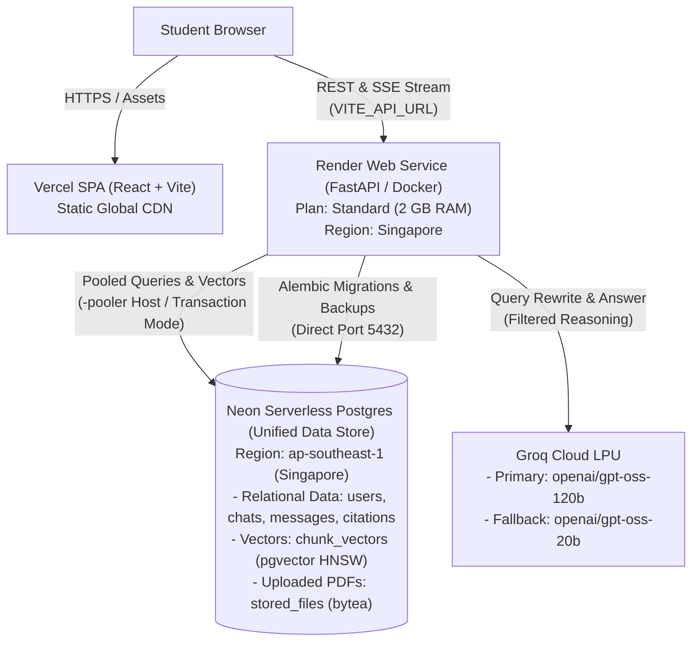
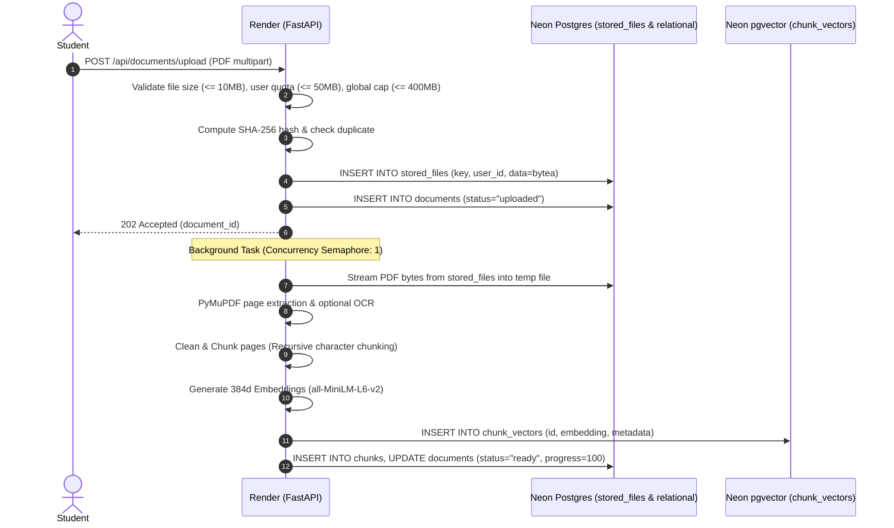
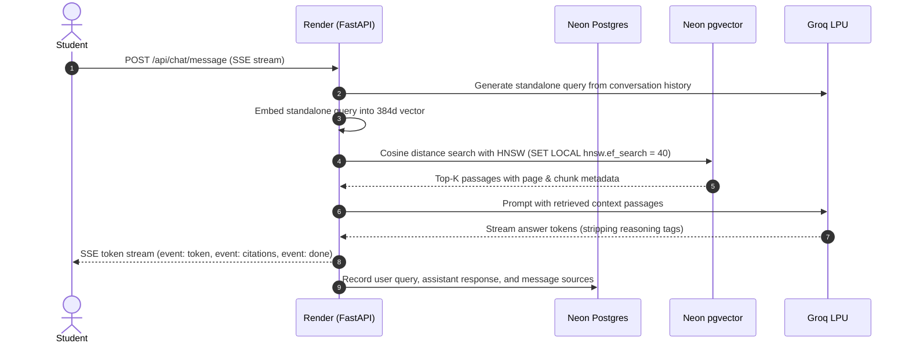

# 🏛️ StudyMate AI — Target Online Architecture

This document describes the production cloud architecture for StudyMate AI. The system is designed to be fully online and stateless, meaning **zero critical data is stored on the application server's local disk**. All relational data, vector embeddings, and PDF files live in **Neon Serverless Postgres**.

---

## 🌐 Architecture Overview

---

## 📦 Stack Components & Service Roles

| Layer | Service / Technology | Plan / Specs | Region | Purpose & Notes |
| :--- | :--- | :--- | :--- | :--- |
| **Frontend** | Vercel | Free / Hobby | Global Edge | Static Vite build. Client makes direct CORS requests to the Render backend via `VITE_API_URL`. SPA routing configured in `vercel.json`. |
| **Backend** | Render Web Service | Standard (2 GB RAM, 1 CPU) | Singapore | Stateless Docker container running FastAPI and PyTorch CPU. Singapore region selected for low-latency co-location with Neon Singapore. |
| **Relational Data** | Neon Postgres | Serverless Free / Launch | `ap-southeast-1` (Singapore) | Relational database (`users`, `chats`, `messages`, `sources`, `feedback`). Uses PgBouncer transaction pooler for application queries. |
| **Vector Database** | Neon `pgvector` | Native Extension | `ap-southeast-1` (Singapore) | Replaces ChromaDB in production. `chunk_vectors` table indexed with HNSW cosine distance (`ef_construction=64, m=16`). |
| **PDF Storage** | Neon `stored_files` | PostgreSQL `bytea` | `ap-southeast-1` (Singapore) | Uploaded PDFs stored directly in database as binary blobs. Eliminates external S3/Supabase storage dependencies. Chunked SQL streaming (`open_stream`). |
| **LLM Inference** | Groq Cloud | Production API | Global | Primary: `openai/gpt-oss-120b`. Fallback: `openai/gpt-oss-20b`. Reasoning tokens (`<think>`) stripped before client streaming. |
| **Local Dev** | Local Disk + SQLite + Chroma | Local Host | Local | Default fallback when cloud variables are omitted, preserving zero-configuration local development. |

---

## ⚡ Data Flow Pipelines

### 1. Document Ingestion Pipeline

### 2. Retrieval-Augmented Generation (RAG) Query Pipeline

