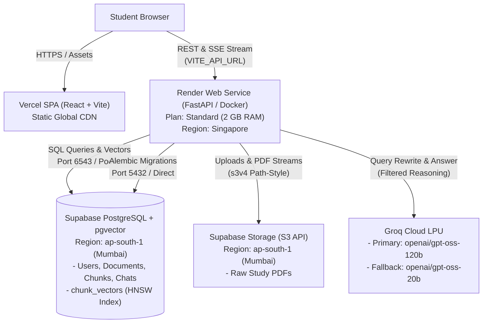
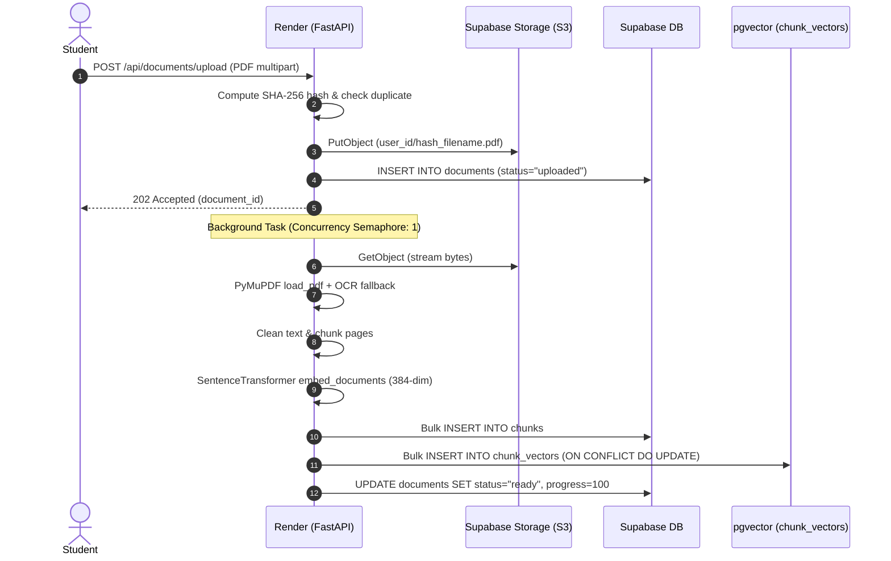
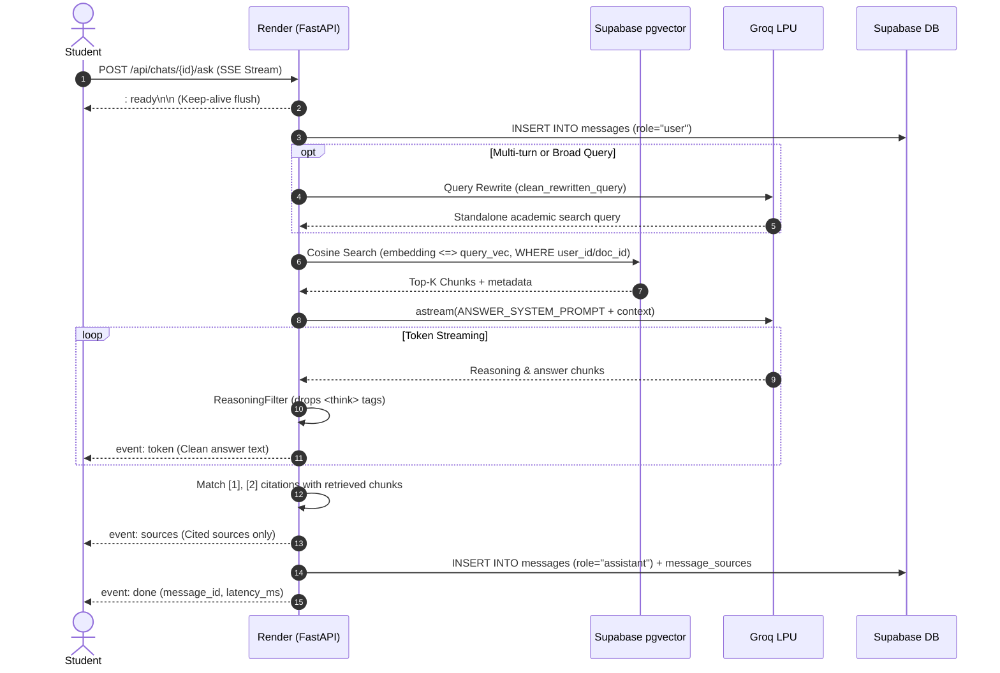

# 🏛️ StudyMate AI — Target Online Architecture

This document describes the production cloud architecture for StudyMate AI. The system is designed to be fully online and stateless, meaning **zero critical data is stored on the application server's local disk**.

---

## 🌐 Architecture Overview

---

## 📦 Stack Components & Service Roles

| Layer | Service / Technology | Plan / Specs | Region | Purpose & Notes |
| :--- | :--- | :--- | :--- | :--- |
| **Frontend** | Vercel | Free / Hobby | Global Edge | Static Vite build. Client makes direct CORS requests to the Render backend via `VITE_API_URL`. SPA routing configured in `vercel.json`. |
| **Backend** | Render Web Service | Standard (2 GB RAM, 1 CPU) | Singapore | Stateless Docker container running FastAPI and PyTorch CPU. Singapore region selected for lowest latency to Supabase Mumbai. |
| **Relational Data** | Supabase PostgreSQL | Free / Pro | `ap-south-1` (Mumbai) | Relational database (users, chats, messages, citations, feedback). Uses transaction pooler (port 6543) for app queries. |
| **Vector Database** | Supabase `pgvector` | Native Extension | `ap-south-1` (Mumbai) | Replaces ChromaDB in production. `chunk_vectors` table indexed with HNSW cosine distance (`ef_construction=64, m=16`). |
| **PDF Storage** | Supabase Storage | S3-Compatible API | `ap-south-1` (Mumbai) | Private storage bucket (`studymate-pdfs`). Accessed via `S3Storage` driver using S3v4 signatures and path-style addressing. |
| **LLM Inference** | Groq Cloud | Production API | Global | Primary: `openai/gpt-oss-120b`. Fallback: `openai/gpt-oss-20b`. Reasoning tokens (`<think>`) stripped before client streaming. |
| **Local Dev** | Local Disk + SQLite + Chroma | Local Host | Local | Default fallback if cloud variables are not provided, preserving zero-configuration local development. |

---

## ⚡ Data Flow Pipelines

### 1. Document Ingestion Pipeline

### 2. Academic RAG Query & Streaming Pipeline

---

## 🛡️ Resilience & Stateless Guarantees

1. **Zero Application Server State**: No user documents, vectors, or sqlite databases remain on Render's ephemeral disk. Containers can restart or auto-scale at any time without data loss.
2. **Memory Safety on 2 GB RAM**:
   - PyTorch installed via CPU-only wheels (`--index-url https://download.pytorch.org/whl/cpu`).
   - `TORCH_NUM_THREADS=2` restricts multithreading overhead.
   - Global ingestion concurrency semaphore (`threading.Semaphore(1)`) prevents concurrent memory spikes during PDF processing.
3. **Database Connection Pooling**:
   - Application queries connect via Supabase Transaction Pooler (`pool_size=5, max_overflow=5, pool_recycle=300`).
   - Migrations (`alembic upgrade head`) execute via `MIGRATION_DATABASE_URL` (direct port 5432 or session pooler) to avoid transaction pooling DDL errors.
4. **SSE Keep-Alive & Disconnect Detection**:
   - Streams emit `: ready\n\n` immediately to flush intermediate reverse proxies.
   - Periodic disconnect checks (`request.is_disconnected()`) abort unneeded LLM tokens when the user navigates away.
