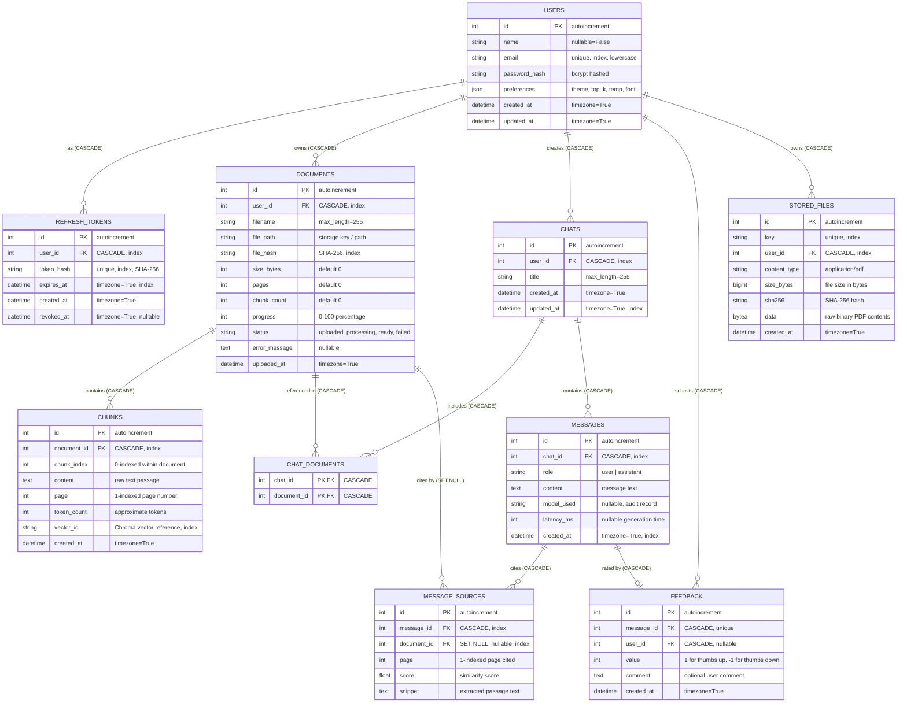

# 🗄️ StudyMate RAG — Database Entity Relationship (ER) Diagram

This document specifies the complete relational database architecture for StudyMate AI. It details all 9 tables, columns, data types, primary/foreign keys, cascade deletion rules, unique constraints, and composite indexes.

---

## 📊 Mermaid ER Diagram

---

## 🗃️ Table Roles & Lifecycle Descriptions

### 1. `users`
- **Role**: Core identity model representing authenticated students/users.
- **Constraints & Indexes**: `email` is unique and normalized to lowercase. Stores UI and retrieval settings (theme, top_k, temperature, font scale) inside the `preferences` JSON column.
- **Lifecycle**: Created during registration; updated on profile or settings changes. Upon account deletion, cascading deletes automatically prune all user documents, chats, refresh tokens, and feedback.

### 2. `refresh_tokens`
- **Role**: Tracks long-lived JWT refresh tokens for session rotation and revocation.
- **Security**: Raw tokens are never stored; only cryptographic SHA-256 hashes (`token_hash`) are persisted.
- **Lifecycle**: Issued during login/registration. Single-use rotation: when `/api/auth/refresh` is called, the existing record is marked with `revoked_at=NOW()` and a fresh token pair is issued. Explicit logout also revokes the token.

### 3. `documents`
- **Role**: Represents an uploaded PDF study material.
- **Constraints & Indexes**: Composite unique constraint `(user_id, file_hash)` prevents accidental duplicate uploads by the same user while permitting distinct users to study identical textbooks. Composite index `(user_id, status)` optimizes dashboard queries.
- **Lifecycle**: Uploaded with status `uploaded` (progress=5), transitions to `processing` (progress=20..80) during OCR/chunking/embedding, and reaches `ready` (progress=100) or `failed`. Deleting a document commits SQL deletion first, then purges ChromaDB vectors and removes the file from storage.

### 4. `chunks`
- **Role**: Relational catalog of document text passages split during ingestion.
- **Constraints & Indexes**: Indexed on `document_id` and `vector_id`. Foreign key `document_id` cascades on document deletion.
- **Lifecycle**: Generated during document ingestion. Serves as the authoritative source of truth for rebuilding vector stores (`scripts/reindex.py`).

### 5. `chats`
- **Role**: Conversation thread scoped to one or more documents.
- **Constraints & Indexes**: Composite index `(user_id, updated_at)` optimizes sidebar chat list sorting.
- **Lifecycle**: Created with a title and selected `document_ids`. Deletion cascades to all constituent messages and citations.

### 6. `chat_documents`
- **Role**: Association table enabling many-to-many relationships between chats and documents.
- **Lifecycle**: Created when chats are initialized or updated. Foreign keys to both `chats.id` and `documents.id` cascade delete automatically.

### 7. `messages`
- **Role**: Individual conversation turn (`user` prompt or `assistant` response).
- **Constraints & Indexes**: Composite index `(chat_id, created_at)` enables rapid chronological rendering. Stores `latency_ms` and `model_used` for observability and evaluation.
- **Lifecycle**: Persisted when the user asks a question and as the SSE stream concludes. Deleting the parent chat removes all messages.

### 8. `message_sources`
- **Role**: Specific evidence citations grounding an assistant's response.
- **Integrity**: `ondelete="SET NULL"` on `document_id`. If an underlying study document is deleted, previous chat history remains legible; `document_id` becomes `NULL`, and the UI displays `"source removed"` while preserving the cited snippet and page number.
- **Lifecycle**: Created immediately after an assistant message is generated with retrieved citations.

### 9. `feedback`
- **Role**: User quality evaluations (thumbs up / thumbs down) for assistant responses.
- **Constraints**: `message_id` is unique (`OneToOne` with assistant messages) with `value` restricted to `+1` or `-1`.
- **Lifecycle**: Submitted via `/api/messages/{id}/feedback`. Cascades on message or user deletion.

### 10. `chunk_vectors` (PostgreSQL / Supabase + pgvector)
- **Role**: Production vector embeddings table replacing ChromaDB on PostgreSQL.
- **Columns**: `id` (PK, string chunk ID), `embedding` (vector(384)), `user_id` (FK to users.id with CASCADE), `document_id` (FK to documents.id with CASCADE), `metadata` (JSONB containing filename, page, tokens, and chunk_index), `created_at` (timestamptz).
- **Indexes**:
  - HNSW index on `embedding vector_cosine_ops` (`m=16, ef_construction=64`) for ultra-fast approximate nearest neighbor search.
  - Btree index on `(user_id, document_id)` for tenant isolation and filtered retrieval.

### 11. `vector_meta` (PostgreSQL / Neon)
- **Role**: Tracks vector schema metadata, active embedding model name, and dimensions to prevent model mismatch.
- **Columns**: `key` (PK, string), `value` (text), `updated_at` (timestamptz).

### 12. `stored_files` (PostgreSQL / Neon)
- **Role**: Direct binary storage for uploaded PDF files (`bytea` in PostgreSQL, BLOB in SQLite). Keeps the application server 100% stateless with zero disk files in production.
- **Columns**: `id` (PK, autoincrement), `key` (unique text string e.g. `'1/notes.pdf'`), `user_id` (FK to `users.id` with `CASCADE`), `content_type` (text, default `'application/pdf'`), `size_bytes` (bigint), `sha256` (64-char string), `data` (binary bytea), `created_at` (timestamptz).
- **Indexes**: Unique index on `key`, index on `user_id`.

